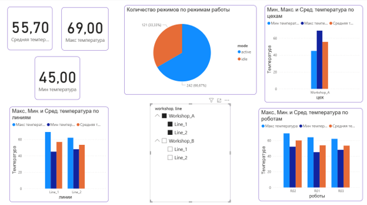
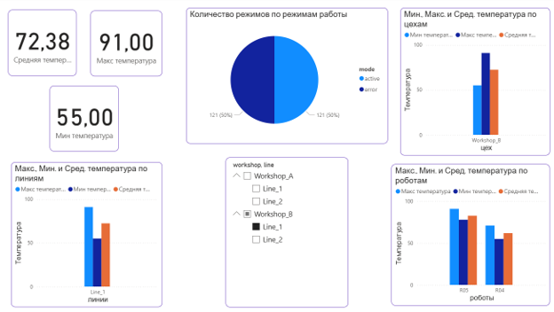

# Мониторинг температуры роботов на производстве

## О проекте

Интерактивный дашборд в Power BI для мониторинга температурных показателей роботов на производственных линиях. Проект позволяет отслеживать минимальные, максимальные и средние значения температуры по иерархии: цех → линия → робот, а также анализировать распределение режимов работы оборудования.

## Используемые инструменты и технологии

- **Power BI Desktop**: построение дашборда, визуализация данных;
- **Power Query**: загрузка и преобразование данных;
- **DAX**: создание мер для агрегации показателей;
- **CSV**: формат исходных данных.

## Данные

В качестве источника использовался файл `sensors_hierarchy.csv`, содержащий данные с производственных датчиков.

Структура данных:
- `timestamp` — временная метка;
- `workshop` — цех (Workshop_A, Workshop_B);
- `line` — производственная линия (Line_1, Line_2);
- `robot_id` — идентификатор робота (R01–R06);
- `mode` — режим работы (active, idle, error);
- `temperature` — температура;
- `pressure` — давление;
- `current` — ток;
- `voltage` — напряжение;
- `error_code` — код ошибки.

## Подготовка данных

В редакторе Power Query все числовые поля (temperature, pressure, current, voltage) были приведены к типу «десятичное число» для корректного выполнения расчетов.

## Структура дашборда

### Иерархия
Создана иерархия **Production Hierarchy** с тремя уровнями для детализации данных:
1. **workshop** (цех)
2. **line** (линия)
3. **robot_id** (робот)

Это позволяет последовательно углубляться от общего к частному при анализе температурных показателей.

### Меры DAX
Для анализа температуры созданы три меры:
- **Средняя температура** — среднее значение температуры;
- **Макс температура** — максимальное значение;
- **Мин температура** — минимальное значение.

Также создана мера **Количество режимов**, которая подсчитывает количество записей для каждого режима работы (active, idle, error).

### Визуализации

На дашборде представлены следующие элементы:

- **Гистограмма по цехам** — показывает минимальные, максимальные и средние значения температуры для цехов Workshop_A и Workshop_B;
- **Гистограмма по линиям** — детализирует температурные показатели по каждой производственной линии;
- **Гистограмма по роботам** — отображает температурные показатели для каждого робота в отдельности;
- **Круговая диаграмма распределения режимов** — показывает долю времени, которое оборудование работает в режимах active, idle и error;
- **Слайсер с иерархией** — позволяет фильтровать данные по цеху, линии и роботу.

## Результаты анализа

На основе построенного дашборда были сделаны следующие выводы:

1. **Температурные показатели:** средняя температура по всем роботам составляет 59,9°C, максимальная достигает 91°C, минимальная — 42°C. Разброс значений указывает на нестабильность работы оборудования.
2. **По цехам:** Workshop_A и Workshop_B демонстрируют схожие температурные профили, однако в Workshop_B зафиксированы более высокие максимальные значения.
3. **По линиям:** Line_1 и Line_2 имеют близкие средние показатели, но максимальные температуры на Line_1 превышают показатели Line_2, что может свидетельствовать о перегрузке или неисправности оборудования на первой линии.
4. **По роботам:** наибольшие температурные значения зафиксированы у робота R05 (максимум достигает критических значений). Роботы R01–R04 и R06 работают в более стабильном диапазоне.
5. **Режимы работы:** большая часть времени (67%) оборудование работает в режиме active, по 16,7% приходится на режимы error и idle. Наличие error требует дополнительного анализа причин их возникновения.

## Скриншот дашборда

[.pbix файл](sensors_monitoring.pbix)
