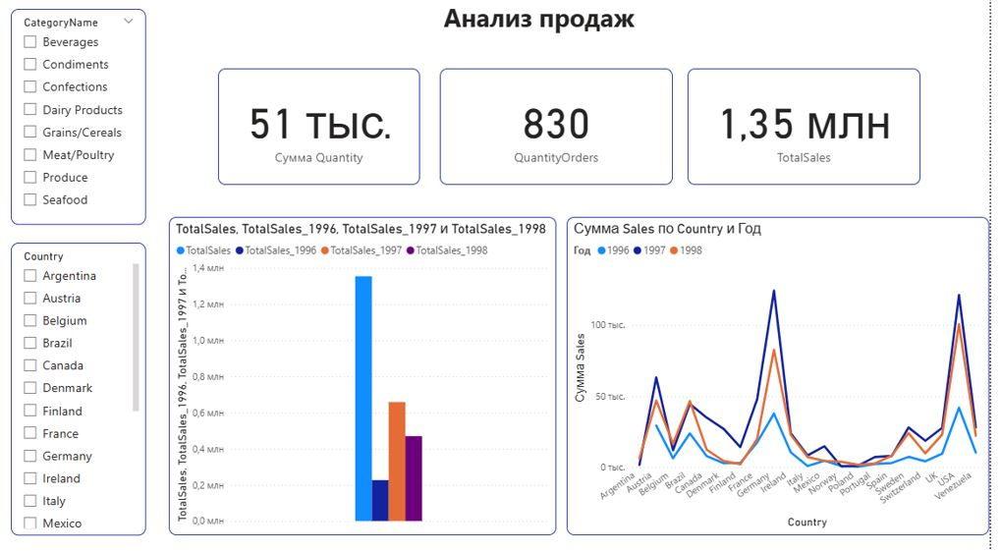
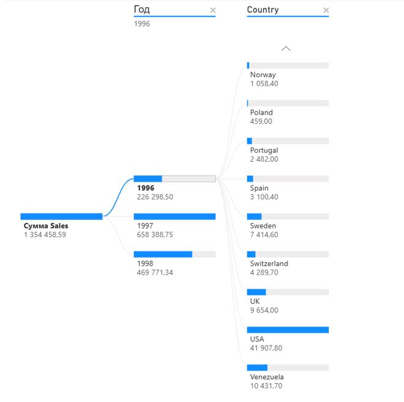
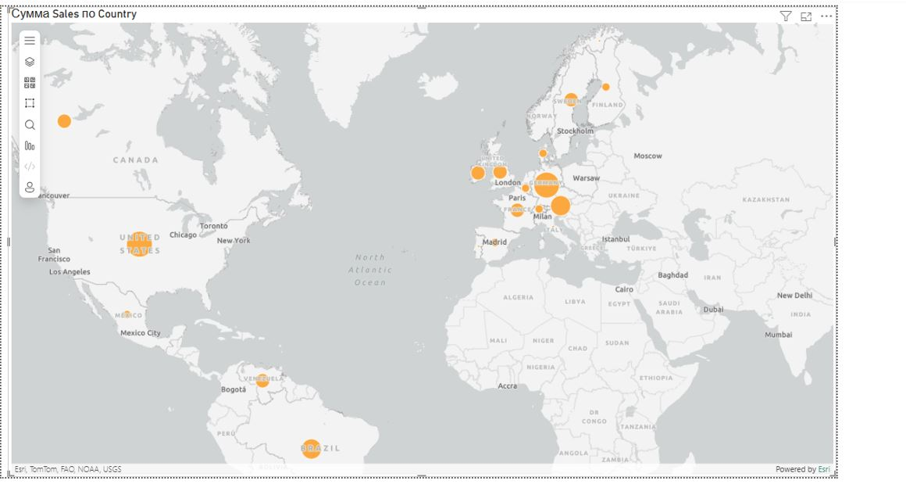

# Анализ продаж (Power BI)

## О проекте

Интерактивный дашборд в Power BI для анализа продаж с использованием продвинутых инструментов визуализации: ключевые факторы влияния, дерево декомпозиции, карта продаж по странам, матрицы и фильтры. Проект демонстрирует навыки работы со сложными отчетами и их настройку для бизнес-пользователей.

## Используемые инструменты и технологии

- **Power BI Desktop**: построение дашборда, визуализация данных;
- **Power Query**: загрузка и преобразование данных;
- **DAX**: создание мер для агрегации показателей;
- **CSV / Excel** — формат исходных данных.

## Данные

В качестве источника использовался набор данных с информацией о заказах и продажах (таблицы Orders, Categories, Countries и др.).

Данные содержат информацию о:
- Заказах по странам и категориям товаров;
- Продажах за разные годы (1996, 1997, 1998);
- Количестве заказов и средней стоимости заказа.

## Структура дашборда

### Сводные таблицы и матрицы

- **Сводная таблица (Таблица)** — отображает основные показатели продаж (TotalSales, QuantityOrders, AverageOrderValue) с группировкой по странам;
- **Матрица** — позволяет анализировать продажи с группировкой по категориям товаров и по годам, а также детализировать данные до уровня конкретных заказов;
- **Настройки свертывания и детализации** — реализована возможность перехода на следующий уровень группировки (по категориям, по годам) с помощью кнопок навигации.

### Визуализации

- **График и гистограмма с накоплением** — на одной оси (Country) объединены TotalSales (гистограмма) и AverageOrderValue (график), что позволяет одновременно оценивать объем продаж и средний чек в разрезе стран;
- **Ключевые факторы влияния** — выполнен анализ продаж по количеству проданного товара с выбором направления анализа (уменьшение); визуализация показывает сегменты данных, которые наиболее сильно влияют на целевой показатель;
- **Дерево декомпозиции** — позволяет декомпозировать общий показатель продаж по категориям, странам и годам, визуализируя вклад каждого сегмента;
- **Карта** — отображает распределение продаж по странам, позволяя оценить географическую структуру бизнеса;
- **Карточки** — выводят ключевые показатели: общее количество товаров (Quantity), количество заказов (QuantityOrders) и общий объем продаж (TotalSales);
- **Фильтры** — реализованы фильтры по категориям товаров (CategoryName) и по странам (Country) для динамического анализа данных.

### Форматирование отчета

- Все визуализации отформатированы для наглядного представления данных сторонним пользователям;
- Реализована интерактивная связанность визуализаций — выбор строки в таблице автоматически обновляет график и другие элементы отчета.

## Результат

Дашборд позволяет:

- Анализировать продажи в разрезе стран, категорий товаров и временных периодов;
- Выявлять ключевые факторы, влияющие на уменьшение продаж;
- Декомпозировать общие показатели до деталей по категориям и странам;
- Оценивать географическое распределение продаж;
- Динамически фильтровать данные и мгновенно получать обновленные визуализации.

## Скриншот дашборда

## Файл проекта

[.pbix файл](sales_analysis.pbix)
